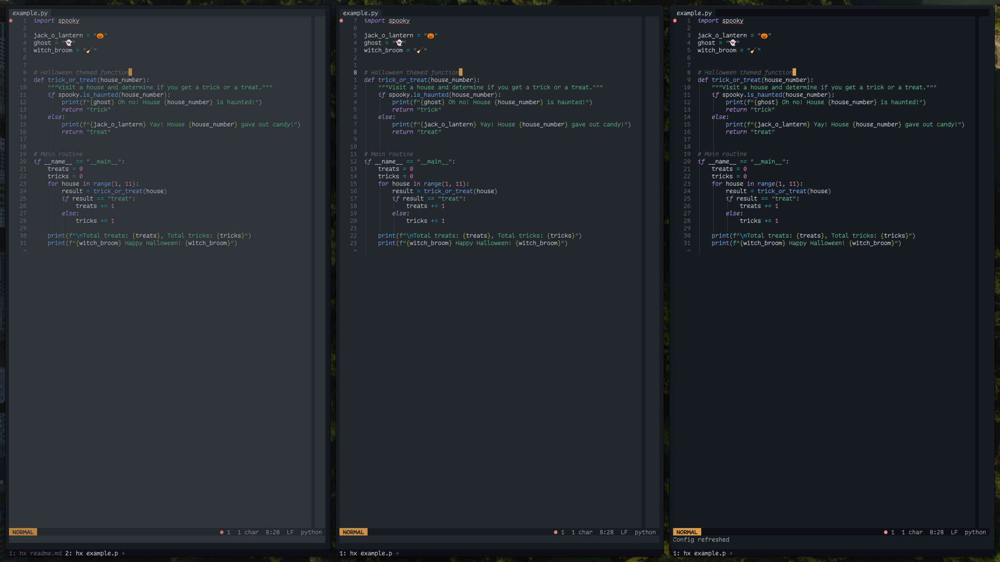

# Halloween theme for Helix

Halloween is a non-canonical implementation of the [penumbra color palette](https://github.com/nealmckee/penumbra) for [Helix](https://github.com/helix-editor/helix).  


## Preview



## Installation

Provide step-by-step instructions on how to install the Halloween theme. For example:

1. Clone this repository or download any of the `.toml` files.
2. Place the `.toml` file in your Helix configuration directory under the `themes` folder.
3. Add the following line to your `config.toml`:

```toml
theme = "halloween_dark_hard" # or halloween_dark_medium or haloween_dark_soft
```

## Contributing

If you'd like to contribute to the Halloween theme, please feel free to submit a pull request or create an issue with your suggestions.

## License

This theme is released under the [MIT License](LICENSE).

## Acknowledgments

- Thanks to Neal McKee for creating the original [penumbra color palette](https://github.com/nealmckee/penumbra).
